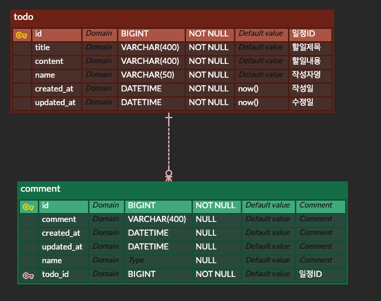
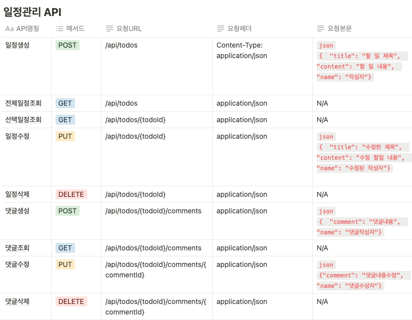

# [일정 관리 앱 (TodoList)]
## 목차
1. [프로젝트소개](#프로젝트소개)
2. [기술스택](#기술스택)
3. [API명세서](#API명세서)
4. [ERD](#ERD)

## 프로젝트소개
- 일정 관리 프로젝트
- 이 프로젝트는 유저가 할 일을 기록하고 관리할 수 있는 일정 관리 어플리케이션 입니다.
- 프로젝트 기간 : 2024년 10월 11일 ~ 2024년 10월 17일

## 기술스택
  - Java(17)
  - SpringBoot(3.3.4)
  - MySQL
  - JPA

## ERD
</img>

## API명세서
</img>

## 주요기능 
- 일정 생성 : 일정을 생성합니다. 
- 일정 전체 조회(일정 페이징) : 전체 일정을 10개마다 페이지별로 조회 합니다.
- 선택 일정 조회 : 선택한 일정을 조회합니다.
- 일정 수정 : 선택한 일정을 수정합니다.
- 일정 삭제 : 선택한 일정을 삭제합니다.
- 댓글 생성 : 일정에 댓글을 생성합니다.
- 댓글 조회 : 선택한 일정의 댓글을 조회 합니다.
- 댓글 수정 : 선택한 일정의 해당 댓글을 수정합니다.
- 댓글 삭제 : 선택한 일정의 해당 댓글을 삭제합니다.
- @Valid : 객체 제약조건을 검증